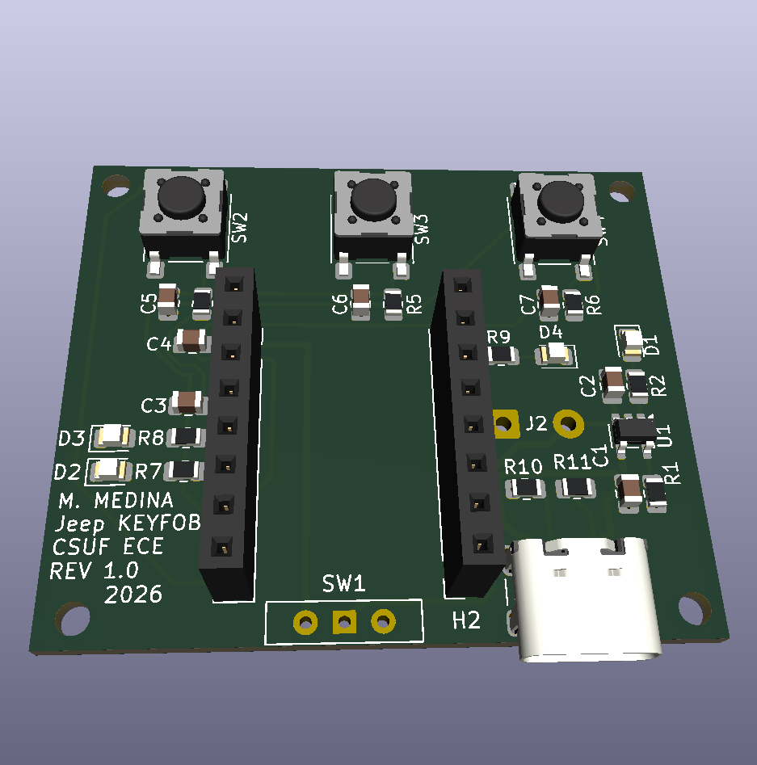

# Jeep Embedded Controls

A custom embedded security and control system for a 1995 Jeep Wrangler, built as a 
personal project to demonstrate full-stack embedded systems development across firmware,
hardware, PCB design, and mobile applications.

## Project Overview

This system provides remote control and real-time GPS tracking for a 1995 Jeep Wrangler
using two custom-designed PCBs, 3D printed enclosures, and a companion web app. The system
communicates wirelessly via ESP-NOW between a keyfob and a main controller, with 4G LTE
cellular for remote GPS tracking accessible from any device.

## Demo

> Live GPS tracker web app: [Jeep Tracker](https://matt99med.github.io/Jeep-Embedded-Controls/)

## PCB Preview

## Features

- Remote kill switch via custom ESP-NOW keyfob (range ~200m)
- Hood sensor triggered siren system with automatic arming
- Remote arm/disarm via keyfob with LED status feedback
- Real-time GPS tracking via 4G LTE cellular (SIM7600G-H)
- Web app for live location tracking via MQTT over HiveMQ
- Control of 5 auxiliary off-road lights (lightbar, spot, fog, pod, chase)
- Panic button on keyfob for immediate siren activation
- Automotive-grade power supply (12V battery → regulated 5V)
- LiPo battery powered keyfob with USB-C charging

## Hardware

### Main Controller (Engine Bay)
- ESP32-DevKit V1 (240MHz dual-core, Wi-Fi, BT)
- SIM7600G-H 4G LTE + GPS module (Waveshare breakout)
- ULN2803 Darlington array (8-channel output driver)
- SP721ABG overvoltage/ESD input protection
- LM25576-Q1 automotive buck converter (12V → 5V, 3A)
- LM74810-Q1 automotive ideal diode/battery protection
- Custom 2-layer KiCad PCB
- Custom Fusion 360 engine bay enclosure

### Keyfob
- ESP32-C3 Super Mini (160MHz RISC-V, Wi-Fi, BT)
- MCP73831 LiPo charger IC (100mA charge rate)
- 3.7V 110mAh LiPo battery (301230 size)
- USB-C charging port (GCT USB4105)
- 3 tactile buttons (Lock, Unlock, Panic)
- 3 LED indicators (Red=Armed, Green=Disarmed, Blue=Panic)
- Slide power switch
- Custom 2-layer KiCad PCB (45.5 x 38.5mm)
- Custom Fusion 360 keyfob enclosure

## Tech Stack

| Category | Technology |
|---|---|
| Firmware | ESP-IDF v6.0 (C) |
| RTOS | FreeRTOS |
| Wireless | ESP-NOW (keyfob ↔ controller) |
| Cellular | SIM7600G-H AT commands over UART2 |
| IoT Protocol | MQTT over TLS (HiveMQ Cloud) |
| PCB Design | KiCad 10.0 |
| 3D Modeling | Autodesk Fusion 360 |
| Web App | HTML/CSS/JavaScript + Google Maps API |
| Version Control | Git/GitHub |
| PCB Fabrication | JLCPCB |

## Repository Structure

    Jeep-Embedded-Controls/
    ├── main_controller/        # ESP32 firmware for main jeep controller
    │   └── main/
    │       ├── main.c          # FreeRTOS task initialization
    │       ├── gpio_handler.c  # GPIO pin control for all outputs/inputs
    │       ├── espnow_handler.c # ESP-NOW wireless communication
    │       └── sim7600.c       # SIM7600 AT commands, GPS, MQTT
    ├── keyfob/                 # ESP32-C3 firmware for keyfob
    │   ├── main/
    │   │   ├── main.c          # Button task and system logic
    │   │   ├── button_handler.c # Debounced button reading
    │   │   ├── led_handler.c   # LED status indicators
    │   │   └── espnow_keyfob.c # ESP-NOW command transmission
    │   └── gerbers/            # Keyfob PCB Gerber files for fabrication
    ├── schematics/             # KiCad schematic PDF exports
    ├── pcb/                    # Main controller PCB layout (in progress)
    ├── fusion360/              # 3D enclosure STL exports
    ├── index.html              # GPS tracker web app
    └── README.md

## System Architecture

    [Keyfob ESP32-C3] <--ESP-NOW 2.4GHz--> [Main ESP32 Controller]
    [Lock/Unlock/Panic]                      [Kill Switch / Siren]
                                             [5x Off-Road Lights]
                                             [Hood Sensor]
                                                     |
                                             [SIM7600G-H Module]
                                                     |
                                          [Hologram IoT SIM / 4G LTE]
                                                     |
                                            [HiveMQ MQTT Broker]
                                                     |
                                         [Web App / iPhone / Any Device]

## PCB Design

### Keyfob PCB (Complete)
- 2-layer board, 45.5 x 38.5mm
- JLCPCB design rules (0.2mm min clearance, 0.2mm min trace)
- GND copper pour on B.Cu
- M2 mounting holes in all 4 corners
- USB-C edge connector for charging

### Main Controller PCB (In Progress)
- 2-layer board
- Automotive environment rated
- Engine bay rated enclosure

## Firmware Architecture

### Main Controller Tasks (FreeRTOS)
| Task | Priority | Stack | Function |
|---|---|---|---|
| sim7600_task | 4 | 8192 | GPS requests and MQTT |
| light_switch_task | 3 | 2048 | Physical switch → light control |
| hood_monitor_task | 5 | 2048 | Hood sensor → siren trigger |
| blink_task | 1 | 2048 | Heartbeat LED |

### ESP-NOW Message Protocol
| Command | Value | Action |
|---|---|---|
| CMD_LOCK | 0x01 | Arm siren + engage kill switch |
| CMD_UNLOCK | 0x02 | Disarm siren + release kill switch |
| CMD_PANIC | 0x03 | Trigger siren immediately |

## Status

- [x] Hardware design complete (KiCad schematics — both boards)
- [x] Main controller firmware (ESP-IDF / FreeRTOS)
- [x] Keyfob firmware (ESP-IDF / ESP-NOW)
- [x] Web app (MQTT + Google Maps — live at GitHub Pages)
- [x] Keyfob PCB layout complete (Gerbers ready for fabrication)
- [ ] Main controller PCB layout (KiCad)
- [ ] PCB fabrication (JLCPCB — ordering both boards together)
- [ ] 3D printed enclosures (Fusion 360)
- [ ] System integration and testing

## Author

**Matthew Medina**  

California State University Fullerton — BS/MS Computer Engineering  

GitHub: [matt99med](https://github.com/matt99med)